# NRMToonLitSample

**Author: 文若**

[toc]

**NRM由四张图构成角色渲染，亮部贴图，阴影贴图图，ilm贴图和细节贴图。**

## 1. 模型贴图基本信息

**原始模型**
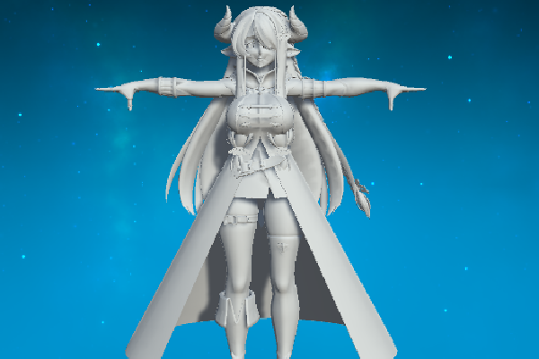

### 1.1 亮度
**亮部贴图RGBA**


**亮部贴图Alpha**
用于区分人物的皮肤区域以及非皮肤区域。
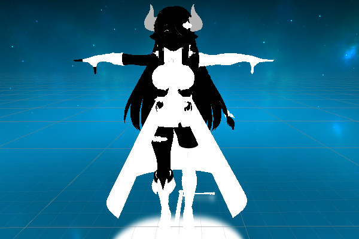

### 1.2 阴影
**暗部颜色RGBA**
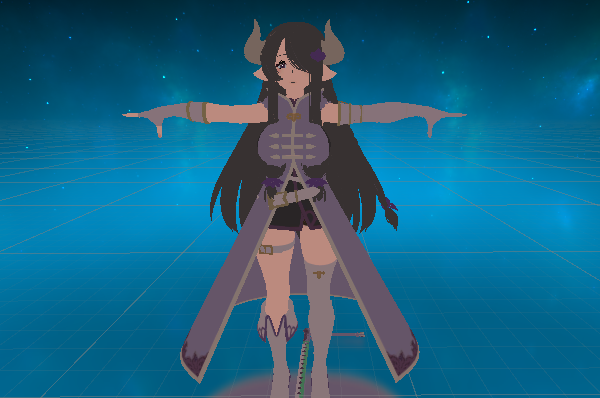

**暗部贴图Alpha**
用于做某些mask使用。
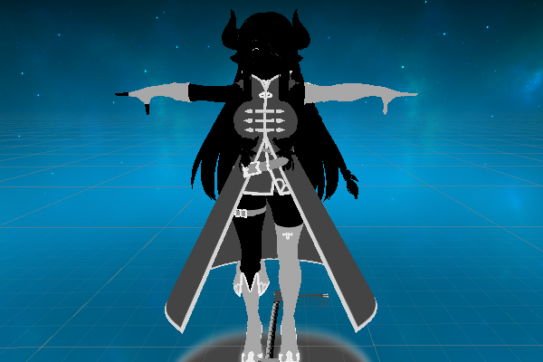

### 1.3 LightMap
**R通道**
控制高光强度
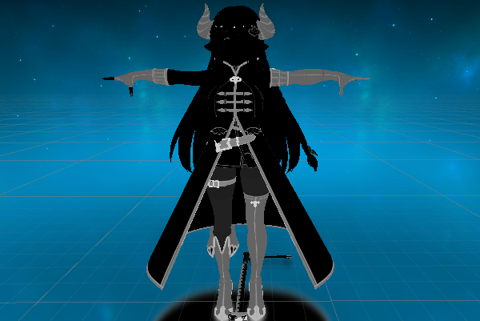

**G通道**
偏移光照，越黑部分越接近阴影，越白部分越接近亮部。128中度灰不会对原来光线进行偏移。
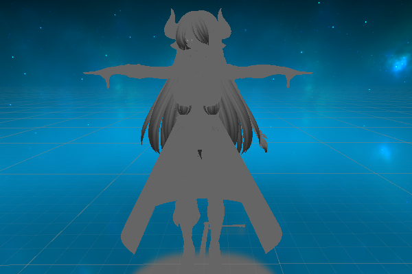

**B通道**
控制高光范围大小（光滑度）越黑部分高光越小，纯黑区域五高光。
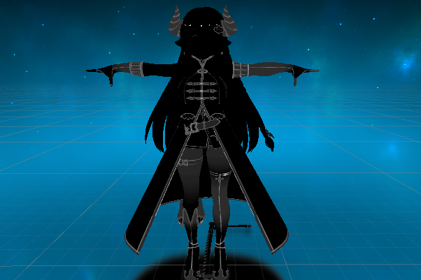

**Alpha通道**
一张描线图，记录描线，内描线。
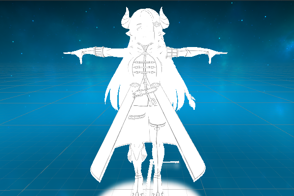

### 1.4 DetailMap
**Detail的RGBA**
使用第二套UV采样，也是描线图。但UV分部并不严格。按照第二套UV做点缀使用。
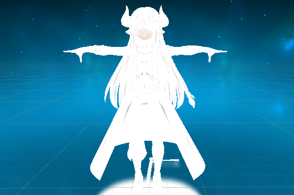

### 1.5 顶点色
**顶点色R通道**
遮挡部分颜色较黑，代表环境光的遮挡。剩余通道控制描边的粗细，深度偏移等信息。
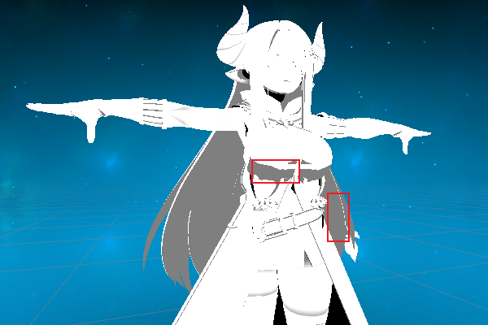

## 2. 基础渲染效果
### 2.1 基础shader Toon
```c#
Shader "Toon"
{
    Properties
    {
        _BaseMap ("Base Map", 2D) = "white" {}
        _SSSMap ("SSS Map", 2D) = "black" {}
    }
    SubShader
    {
        Tags
        {
            "RenderType"="Opaque"
        }
        LOD 100

        Pass
        {
            CGPROGRAM
            #pragma vertex vert
            #pragma fragment frag
            #pragma multi_compile_fwdbase
            #include "UnityCG.cginc"
            #include "AutoLight.cginc"

            struct appdata
            {
                float4 vertex : POSITION;
                float2 texcoord0 : TEXCOORD0;
                float2 texcoord1 : TEXCOORD1;
                float3 normal : NORMAL;
                float4 color : COLOR;
            };

            struct v2f
            {
                float4 pos : SV_POSITION;
                float4 uv : TEXCOORD0;
                float3 pos_world : TEXCOORD1;
                float3 normal_world : TEXCOORD2;
            };

            sampler2D _BaseMap;
            sampler2D _SSSMap;

            v2f vert(appdata v)
            {
                v2f o;
                o.pos = UnityObjectToClipPos(v.vertex);
                o.pos_world = mul(unity_ObjectToWorld, v.vertex).xyz;
                o.normal_world = UnityObjectToWorldNormal(v.normal);
                o.uv = float4(v.texcoord0, v.texcoord1);
                return o;
            }

            half4 frag(v2f i) : SV_Target
            {
                half2 uv1 = i.uv.xy;
                half2 uv2 = i.uv.zw;
                half4 base_map = tex2D(_BaseMap, uv1);
                half4 sss_map = tex2D(_SSSMap, uv1);

                return base_map;
            }
            ENDCG
        }
    }
}
```

### 2.2 光照模型效果
```c#
// 单位向量
float3 normalDir = normalize(i.normal_world);
// 光照方向
float3 lightDir = normalize(_WorldSpaceLightPos0.xyz);
// light
half NdotL = dot(normalDir,lightDir);
return NdotL.xxxx;
```

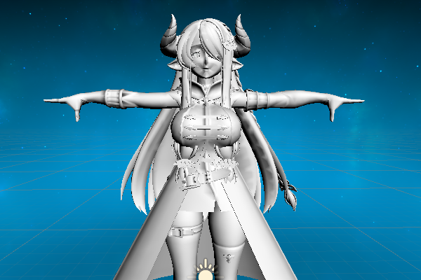


####  第一步：光照色阶

**模型色阶**

```c#
half toon_diffuse = step(0.0, NdotL); // 色阶化
```

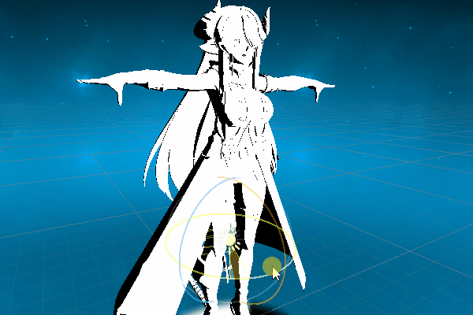

**图形色阶化**

加入阈值范围和硬度

```c#
_ToonThreshold ("ToonThreshold", Range(0,1)) = 0.6 // 阈值范围
_ToonHardness ("ToonHardness",Float) = 50.0 // 过渡的生硬情况
```

```c#
half4 base_map = tex2D(_BaseMap, uv1);
half3 base_color = base_map.rgb;
half NdotL = dot(normalDir, lightDir); // 结果在（-1~1）
half half_lambert = (NdotL + 1.0) * 0.5; // 缩放到0-1之间
// 偏移光照位置
half toon_diffuse = saturate((half_lambert - _ToonThreshold) * _ToonHardness);
// 颜色*base图片的灰度值
half3 final_diffuse = toon_diffuse * base_color;
return float4(final_diffuse, 1.0);
```

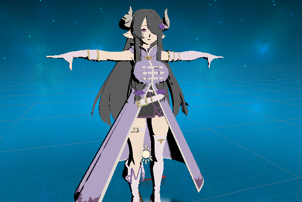

**提高阴影面的亮度**

1.第一种方法，原有亮度的0.5倍

```c#
toon_diffuse = saturate(toon_diffuse + 0.5); // 提亮光照
```

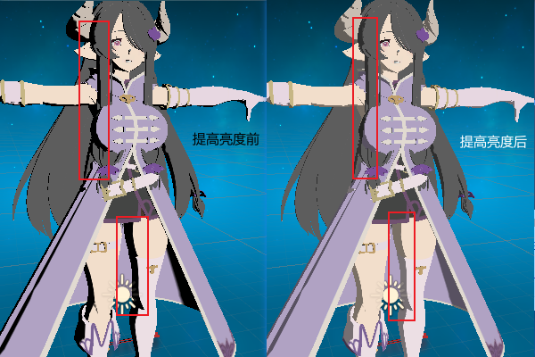

2.采用阴影面贴图，拿到阴影面rgb和toondiffuse做插值计算

```c#
half4 sss_map = tex2D(_SSSMap, uv1);
half3 sss_color = sss_map.rgb;
half NdotL = dot(normalDir, lightDir); 
half half_lambert = (NdotL + 1.0) * 0.5; 
half toon_diffuse = saturate((half_lambert - _ToonThreshold) * _ToonHardness);
half3 final_diffuse = lerp(sss_color, base_color, toon_diffuse);
```
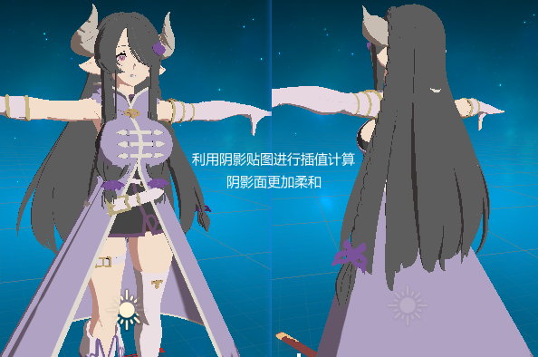


#### 第二步：增加ILM贴图

```c#
// ILM贴图
half4 ilm_map = tex2D(_ILMMap,uv1);
float spec_intensity = ilm_map.r; // 控制高光的强度
float diffuse_control = ilm_map.g * 2.0 - 1.0; // 控制光照偏移，从0-1转换成-1~1
float spec_size = ilm_map.b; // 控制高光的大小
float inner_line = ilm_map.a; // 用来控制内描线
```

当前头发没有任何阴影，需要为头发末端添加光照阴影。

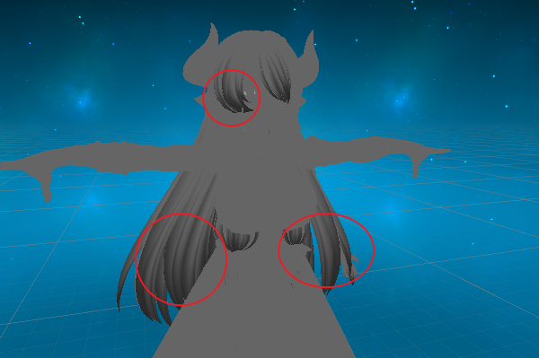

光照贴图的g通道，提前预设阴影区域，给角色头发做光照偏移的效果。这是一张灰度图，以0.5为分界线，灰度值高于128（0.5）的部分提前变亮，等于128的部分不会对光照进行偏移，低于128的部分变暗。

**使用光照贴图优化**

```c#
half lambert_term = half_lambert + diffuse_control; // 做一个偏移控制
half toon_diffuse = saturate((lambert_term - _ToonThreshold) * _ToonHardness);
```

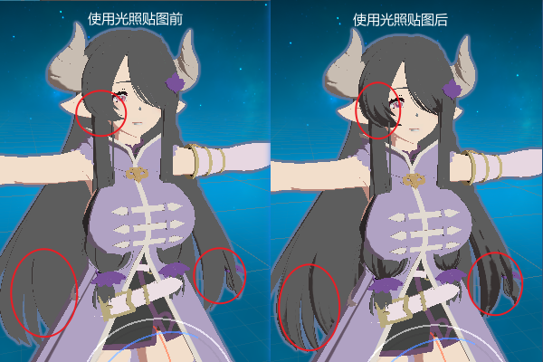

#### 第三步：顶点信息

当前效果中裙子内部应该是暗面，利用ao信息来渲染。

```c#
float4 vertex_color : TEXCOORD3;
o.vertex_color = v.color;
```

```c#
float ao = i.vertex_color.r;
half lambert_term = half_lambert * ao + diffuse_control;
```

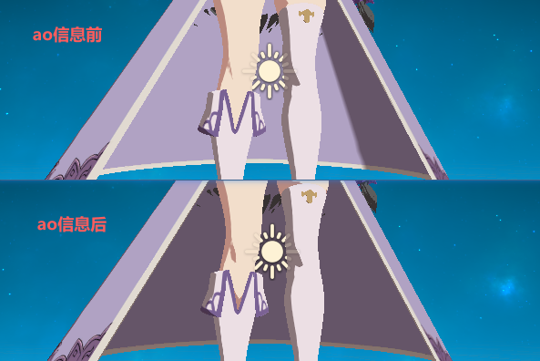

### 2.3  当前渲染效果展示

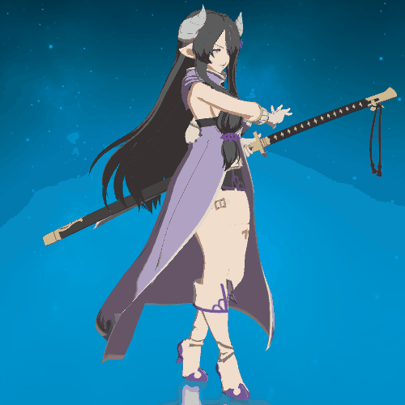

## 3. 卡通高光

### 3.1 增加高光效果

一个完整的效果应该有漫反射和高光反射，上一节完成了漫反射效果。圈中的金属质感部分需要进行高光处理

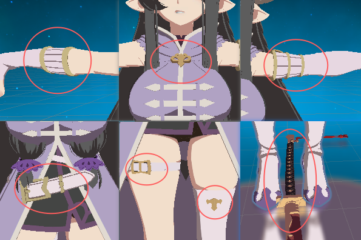

ILM图的B通道控制高光形状的大小，高光部分越黑越光滑，形状也越小。

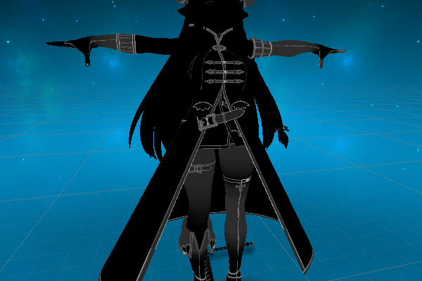

使用NotV进行计算，并且为这个值加上偏移结果

```c#
// 视觉方向
float3 viewDir = normalize(_WorldSpaceCameraPos - i.pos_world.xyz); 
```

```c#
// 高光处理
float NdotV = (dot(normalDir, viewDir) + 1.0) * 0.5; //拿到NdotV并进行数值范围缩放
float spec_trem = NdotV * ao + diffuse_control; // 光线偏移
```

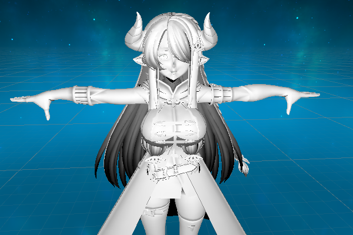

**增加高光系数**

```c#
_SpecSize ("Spec Size",Range(0,1)) = 0.1 // 高光系数
```

```c#
// 高光处理 拿到NdotV并进行数值范围缩放
float NdotV = (dot(normalDir, viewDir) + 1.0) * 0.5;
float spec_trem = NdotV * ao + diffuse_control; // 光线偏移
// 当前高光是基于视角的高光 真正高光收到光照方向的影响
spec_trem = half_lambert * 0.9 + spec_trem * 0.1; // 高光权重分配
// 限制边缘
half toon_spec = saturate((spec_trem - (1.0 - spec_size * _SpecSize)) * 500); // 内部数值越大越光滑
```

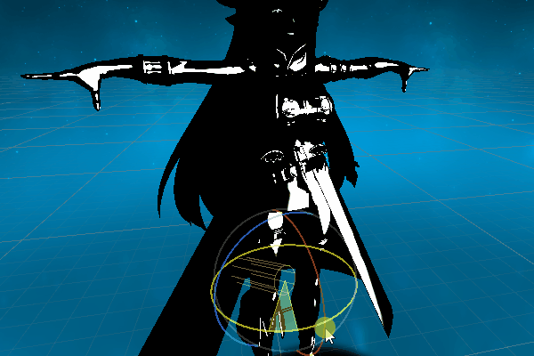

对高光和Base颜色进行叠加，金属部分光线对比之前漫反射渲染效果有了明显变化。

```c#
half3 final_spec = toon_spec * base_color * spec_intensity;
half3 final_color = final_diffuse + final_spec;
return float4(final_color, 1.0);
```

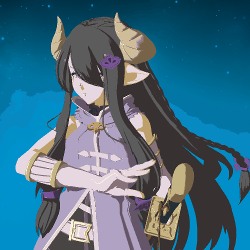

### 3.2 高光颜色优化

对高光颜色优化，增加可自定义的高光颜色。

```c#
// 自定义的高光颜色与原来的颜色进行混合
half spec_color = (_SpecColor.xyz + base_color) * 0.5;
half3 final_spec = toon_spec * spec_color * spec_intensity;
```

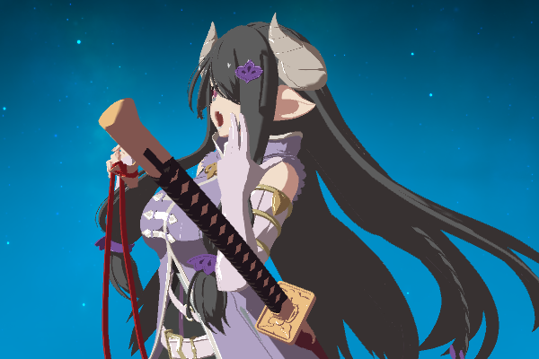

## 4. 角色描边

