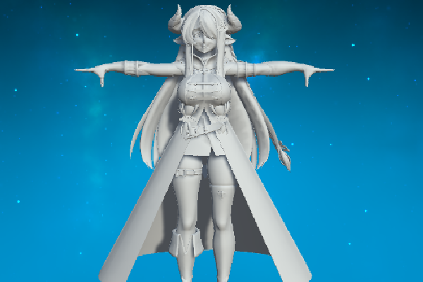
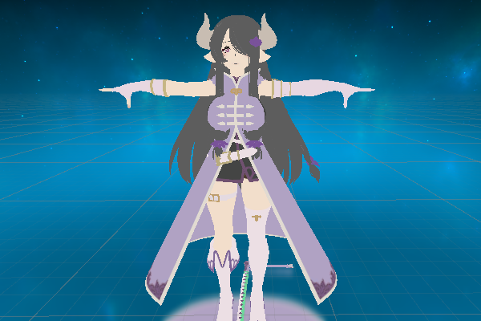
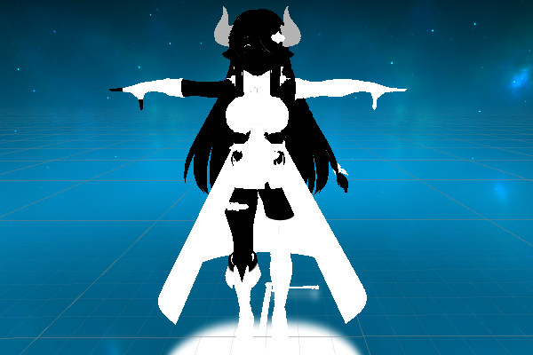
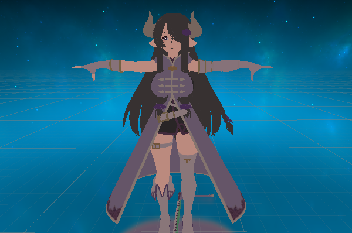
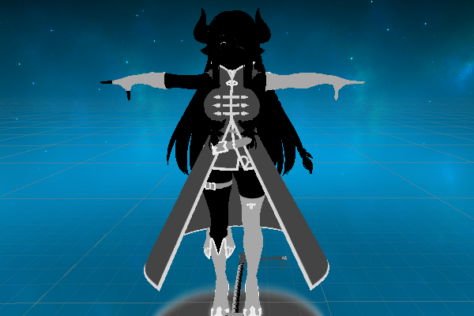
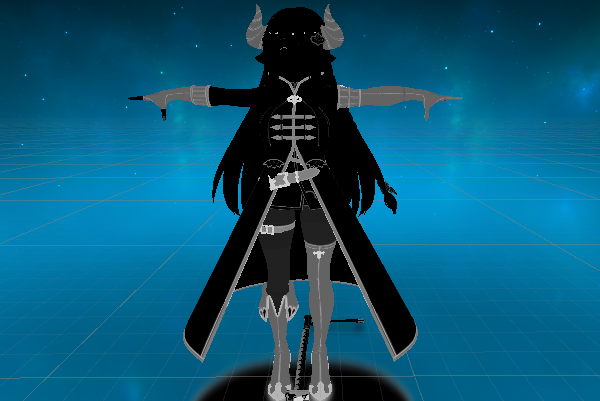
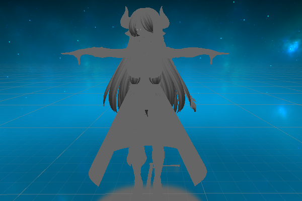
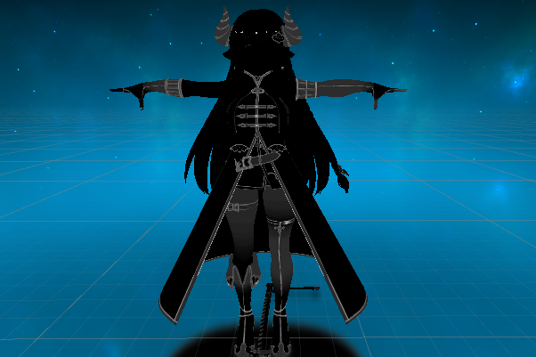
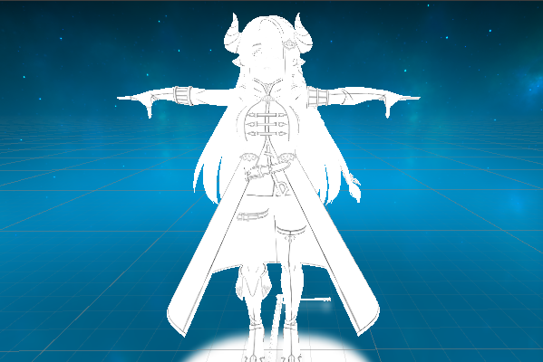
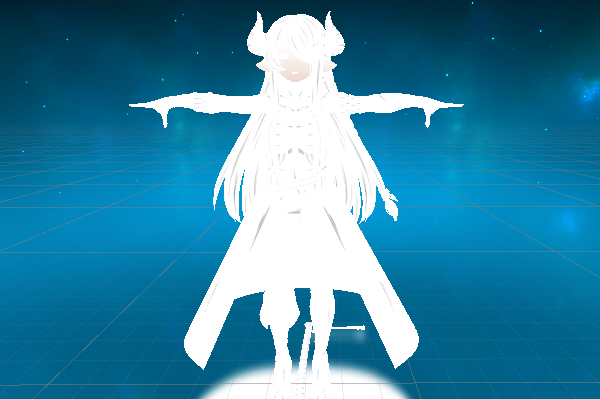

# NRM
NRM由四张图构成角色渲染，亮部贴图，阴影贴图图，ilm贴图和细节贴图。

**原始模型**

## 1.亮度
**亮部贴图RGBA**

**亮部贴图Alpha**

用于区分人物的皮肤区域以及非皮肤区域。

## 2.阴影
**暗部颜色RGBA**

**暗部贴图Alpha**

用于做某些mask使用。

## 3.LightMap
**R通道**
控制高光强度

**G通道**
偏移光照，越黑部分越接近阴影，越白部分越接近亮部。128中度灰不会对原来光线进行偏移。

**B通道**
控制高光范围大小（光滑度）越黑部分高光越小，纯黑区域五高光。

**Alpha通道**
一张描线图，记录描线，内描线。

## 4.DetailMap
**Detail的RGBA**
使用第二套UV采样，也是描线图。但UV分部并不严格。按照第二套UV做点缀使用。

